# 更新日志

产品发布相对**上一次公开版本**记录变化；仅日志、介绍、配图或维护文档的更新合并到所属版本，不分配新版本号。当前版本见 [VERSION](VERSION)；版本号用于仓库迭代记录，与 App 构建号和 Python 包版本独立。新增、Bug 修复和改进分开说明；没有变化时明确写「无」。后续维护规范见 [AGENTS.md](AGENTS.md)。

## v3.3.2 · Bug 修复 · 2026-09-15 · 第 18 次迭代 — 分区识别与系统兼容

**对比上一正式版本：** [v3.3.1 → v3.3.2](https://github.com/keeencra/codex-quota-watch-plus/compare/v3.3.1...v3.3.2)。修复既有分组遗漏并明确 iOS 26／27 兼容，升修订号；开发工具升级不单独计次。

### 新增内容

- 无。

### Bug 修复

- Mac 侧栏创建自定义分区后，手机「全部任务」仍只按项目排序，分区名称、分区顺序及独立任务的位置丢失。现在读取当前账户的侧栏配置，按分区展示项目与独立任务，保留空项目与默认项目分区。
- 处理迁移前后的项目 ID、分区重排、重命名、置顶、重复项目引用及已归档任务；每次刷新重新读取。旧接口没有分区字段时保留项目列表，配置更新期间遗漏的任务仍然可见。

### 改进

- 分区内项目采用文件夹标题，独立任务直接显示；「进行中与待处理」按同一层级过滤，不重复显示任务。

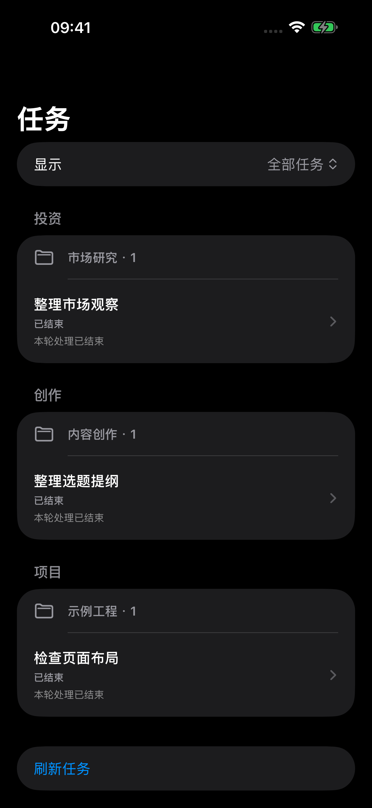

之前仅有项目分组 → 现在保留分区与项目层级。iOS 模拟器截图，全部数据虚构；生成源码见 `docs/gallery/sidebar_sections.py`，不是用户真机截图。

### 验证与升级说明

- 169 项 Python、76 项共享 Swift 测试通过；Xcode 26.6 签名构建与 Xcode 27 手机／手表构建通过。最低版本保持 iOS 17／watchOS 10，不强制升级到 27；[兼容范围与实际验证](docs/compatibility.md)。
- Mac 网关已部署，真实鉴权接口返回有序分区并禁用缓存。iPhone 与 Apple Watch 安装回执确认成功，保留配对与数据；用户确认真机已显示分区。
- 设备升级 iOS／watchOS 27 后，Xcode 26.6 无法挂载手表开发者映像。Mac 更新到 Xcode 27.0 并完成系统组件初始化后，手表安装回执确认成功；属于本地开发环境适配，不另计产品版本。

## v3.3.1 · Bug 修复 · 2026-09-15 · 第 17 次迭代 — 旧任务停滞误报

**对比上一正式版本：** [v3.3.0 → v3.3.1](https://github.com/keeencra/codex-quota-watch-plus/compare/v3.3.0...v3.3.1)。仅修复既有通知误报，升修订号，不增加功能。

### 新增内容

- 无。

### Bug 修复

- 聊天归档后，日志路径改变触发历史重读，分段扫描还没读到结束事件就向 Bark 连续发送旧轮次的“可能停滞”。归档日志现在不参与运行监控，活跃日志尚未读完时不判停滞，旧轮次计时与未发送提醒失效。
- 同一聊天的多个日志乱序读取，或旧工具结果晚于新轮次返回时，不再重新启动旧轮次的停滞计时。
- 停滞判断不再覆盖原事件时间，后续读到的真实结束／中断事件能够纠正状态；拒绝过期事件后不重建计时器。历史结束记录超过通知有效期时不补发通知。

### 改进

- 无。通知文字与界面未改动，无新增配图。

### 验证与升级说明

- 166 项 Python 测试通过，覆盖归档移动、超过扫描预算的日志积压、晚读结束事件、新轮次取代旧计时器、过期完成提醒及既有通知行为；测试使用模拟网络，不发送 Bark 测试通知。
- 本机通知模块已部署并恢复运行，依据真实日志纠正旧状态；无待发送停滞提醒。现有配对、凭据和通知偏好保留，无需重装手机和手表。

### 文档与维护补充 · 2026-09-15

- 产品新增与 Bug 修复：无。本次修正项目首页只更新版本摘要、正文与展示图滞后的问题；补齐 Mac 统一滚动面板、每日 token、三种尺寸组件、通知行为及 Mac 独立安装入口。
- README 采用已发布的 v3.3.0 面板和 v3.2.0 组件图片，标明原生离屏渲染、虚构数据与沿用关系；旧组件图库保留为历史资料。增加首页正文与图片的发布核对规范。
- 沿用 v3.3.1、第 17 次有效迭代；不移动标签、不重写原始源码包。检查本地图片与链接，并在推送后读取 GitHub 实际渲染页面。

## v3.3.0 · 小更新 · 2026-09-15 · 第 16 次迭代 — 每日 token 与统一滚动面板

**对比上一正式版本：** [v3.2.1 → v3.3.0](https://github.com/keeencra/codex-quota-watch-plus/compare/v3.2.1...v3.3.0)。新增兼容的每日用量趋势与局部面板交互改进，升次版本，计一次有效迭代。

### 新增内容

- Mac 菜单栏展开新增最近 7 个公历日（含今天）的 竖向 token 柱状图，Codex 与 DeepSeek 分开展示、独立刻度，标注每日数值及 7 天合计；向下滚动至「每日 token · 精确数值」可查看未缩写的整数。
- Codex 读取本机会话用量事件的增量，含缓存输入但不重复相加；DeepSeek 只读本机工具调用数据库，不包含其他软件或其他设备的消耗，不调用付费模型。0 表示无已记录用量，记录不可用显示 —，缺失调用用量明确提示。

之前只有最近 8 个任务累计用量 → 现在新增按日期、按提供方区分的用量趋势，原任务详情仍保留。下图为当前 AppKit 原生视图离屏渲染、虚构数据，展示滚动面板的不同位置，不是桌面截图；渲染源文件为 `macos/scripts/render_daily_tokens.py`。

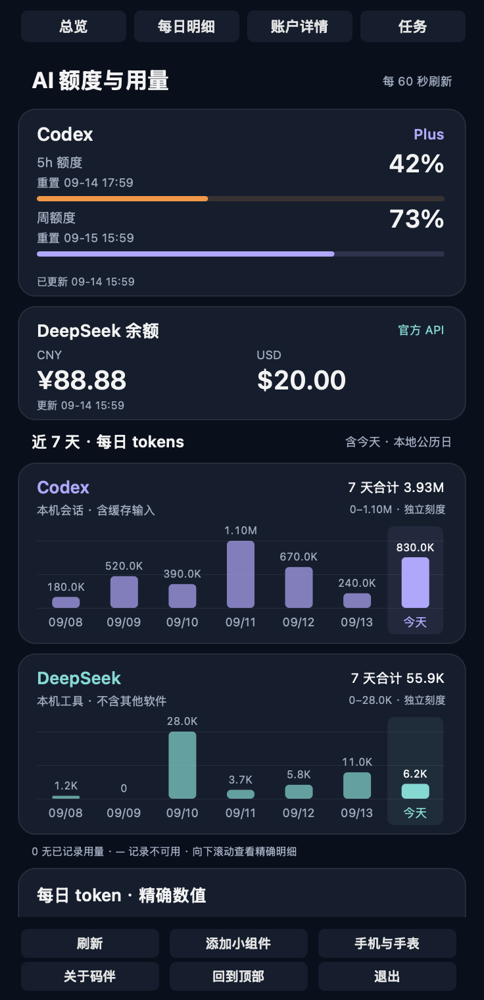

### Bug 修复

- 无。

### 改进

- 历史统计独立后台加载，未改变的会话文件使用缓存；追加事件增量读取。额度卡片压缩留白、DeepSeek 双币余额并排显示，减少面板高度；较短屏幕仍可滚动，充值／赠送拆分与任务详情整合进同一个滚动面板。

- 展开入口统一为深色滚动面板，移除两个独立详情子菜单。顶部快捷定位、底部操作按钮统一样式，刷新保留滚动位置，任务标题完整换行。

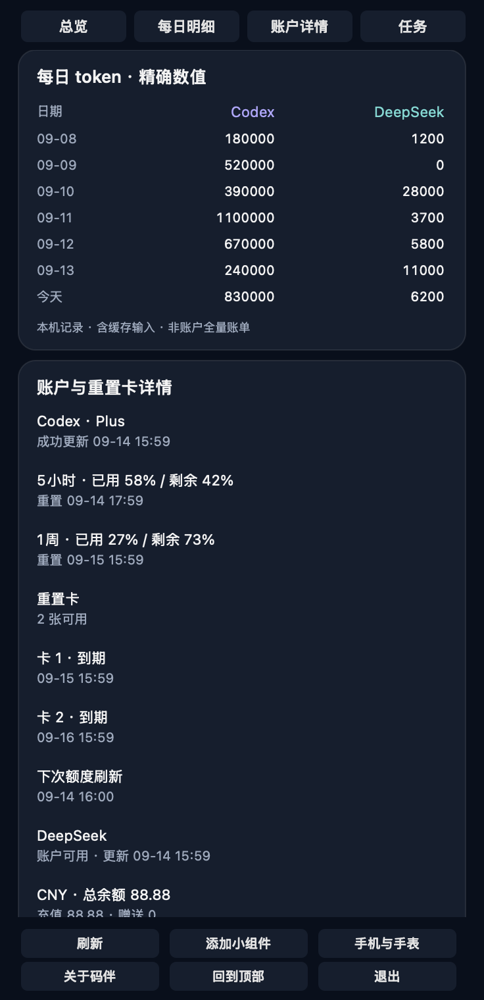
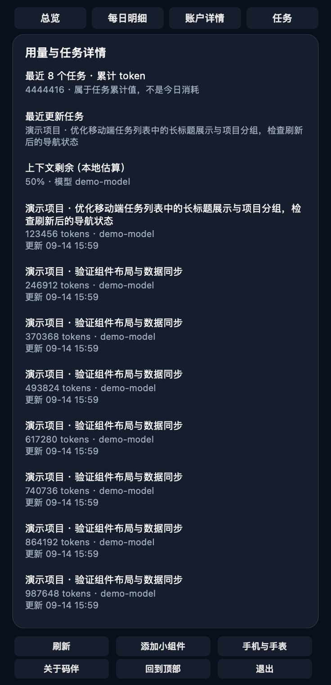

### 验证与升级说明

- 回归覆盖公历／跨午夜、缓存输入、重复事件与归档副本去重、累计计数重置、文件缓存更新、DeepSeek 缺失／未来记录与 token 字段回退；原生 Plus／Pro 面板离屏检查通过。本机数据读取成功，统计不保证已删除或未落盘记录的完整性。
- Mac 完整检查、签名构建和安装通过（构建 32），确认进程运行；原生控制器定位、刷新保留滚动偏移和回到顶部验证通过；实际连续滚动体验待用户查看。无需改动手机和手表，本批同步 v3.3.0 源码与 Release。

## v3.2.1 · Bug 修复 · 2026-09-14 · 第 15 次迭代 — Mac 面板公历日期

**对比上一正式版本：** [v3.2.0 → v3.2.1](https://github.com/keeencra/codex-quota-watch-plus/compare/v3.2.0...v3.2.1)。仅修正已有日期显示错误，升修订号，不增加功能或改变核心流程。

### 新增内容

- 无。

### Bug 修复

- Mac 额度面板在系统历法为波斯历时，将公历 09-14、09-19 显示为 06-23、06-28；统一重置时间、额度更新时间与 DeepSeek 采集时间为公历，保留本地时区。只修显示转换，不改变原始时间戳或用户系统设置。

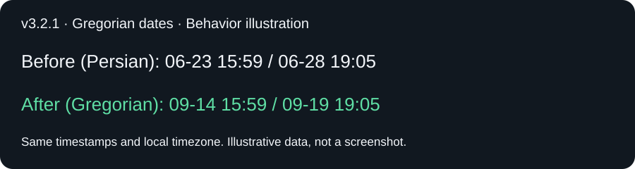

### 改进

- 无。

### 验证与升级说明

- 已复现系统波斯历输出 06-23；补充公历显示、时区转换及空时间回归检查。Mac 全套检查、签名构建与安装通过（构建 29）；实际面板显示待用户确认。手机与手表代码未变，本次无需重新安装移动端。

## v3.2.0 · 小更新 · 2026-09-13 · 第 14 次迭代 — 大号布局与菜单栏双币种

**对比上一正式版本：** [v3.1.0 → v3.2.0](https://github.com/keeencra/codex-quota-watch-plus/compare/v3.1.0...v3.2.0)。包含小时级时间提示与局部排版改进，升次版本；不改变核心流程。

### 新增内容

- 无。

### Bug 修复

- DeepSeek 同时有人民币和美元余额时，菜单栏原先优先人民币并省略美元；现在按 CNY／USD 顺序并列显示所有非零余额，不换算或合并币种。只有一种币种有余额时保持紧凑显示；全部为零时保留各币种零值。

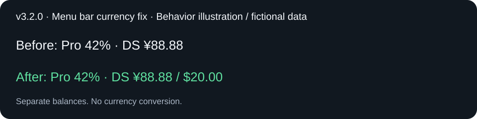

之前只显示人民币 → 修复后分别显示人民币和美元；此图为行为示意，不是真机截图。

### 改进

- 大号组件上半区垂直居中，缩短竖线、放大重置与到期时间；新增距额度重置、重置卡到期的小时级提示。倒计时按组件时间线计算，不承诺即时刷新。
- DeepSeek 固定人民币在左、美元在右；兼容 Plus 双窗口、多卡和未配置余额场景。大号展示总卡数与最早到期的 2 张明细，更多记录见菜单栏。
- 本批包含局部界面与兼容信息展示改进，按次版本 v3.2.0 发布，不升主版本。

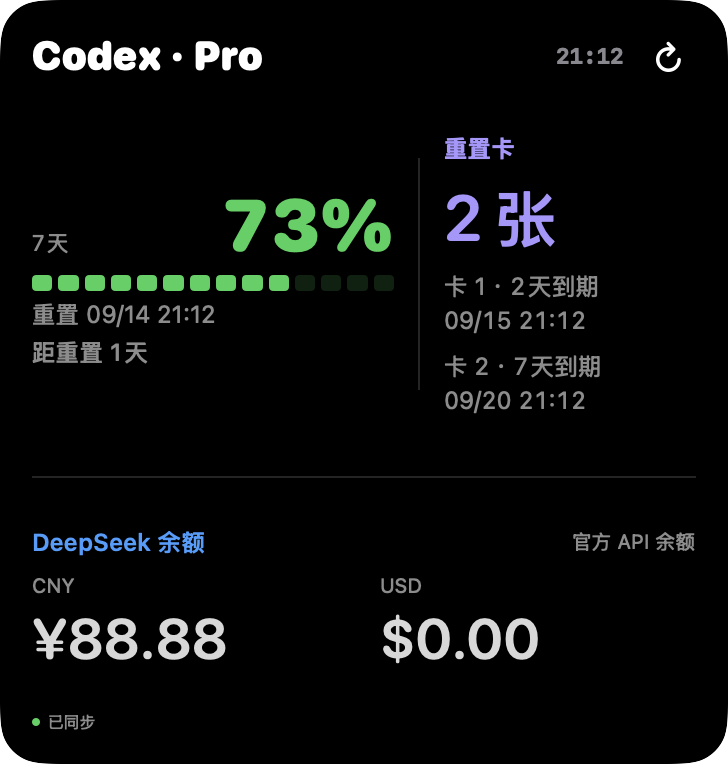

### 验证与升级说明

- 增加双币种、仅人民币、仅美元、零余额、空数据及完整菜单栏标题回归检查；Mac 全套检查、签名构建和安装通过（构建 27）；菜单栏 UI 自动读取超时，最终屏幕显示待用户确认。大号排版另通过 Mac 全套检查、iOS 模拟器构建及 Pro／Plus／多卡／无 DeepSeek 离屏检查，Mac 构建 28 已安装；手机签名构建及安装通过，最终显示待用户确认。本批统一计为第 14 次迭代。

## v3.1.0 · 小更新 · 2026-09-13 · 第 13 次迭代 — Mac 显示端与统一小组件

**对比上一正式产品版本：** [v3.0.1](https://github.com/keeencra/codex-quota-watch-plus/compare/v3.0.1...v3.1.0)。本次为可选显示模块与局部界面改进，保留手机／手表服务协议及核心流程，升次版本；不因多次本地提交单独增加产品版本。

### 新增内容

- 集成原生 Mac 菜单栏、额度面板及桌面 WidgetKit 显示模块，可只在 Mac 使用；保留 MIT 许可、共享容器和安装入口。手机／手表按需部署。
- Mac 和 iPhone 均通过一个「码伴」入口提供小／中／大三种尺寸；iPhone 新增大号账户总览，跨端共用界面实现。
- 新增重置卡数量、到期时间只读展示。手机鉴权接口仅返回数量与时间等白名单字段，不包含卡片标识、不提供兑换；兼容旧快照，未知不当成零张。

### Bug 修复

- Mac 的 `Pro Lite` 套餐在共享视图显示成「套餐未知」：兼容空格、连字符与下划线变体，正确显示 Pro。
- 组件进入系统单色模式时出现浅色整块、空进度段看似全部点亮：移除内容层不透明背景，并通过透明度区分空段与已用段。代码与构建已验证，实际窗口切换效果仍待实机确认。
- Codex token 统计重复加上已包含在输入内的缓存 token，且重复累计未变化事件：按非缓存输入＋缓存＋输出及累计差值统计，正式会话目录存在时不再扫描备份；十亿级计数使用 B。
- 更新后旧扩展进程继续显示旧界面：安装时重新注册扩展、退出本应用旧扩展；移除重复启动应用的操作。
- Mac 签名产物改在本地缓存目录生成，避免云同步目录附加属性造成签名失败。

### 改进

- 原先两套组件入口与中号信息结构，统一为一个入口：中号左侧额度、右侧 DeepSeek 余额、底部用量与卡数；未配置 DeepSeek 时右侧显示重置卡。移除贯穿竖线，降低辅助信息字号。
- 大号上半区为额度与右侧重置卡，下半区为 DeepSeek 余额；按窗口数量分配高度，减少留白并放大关键数字。
- 各尺寸统一绿色额度进度条（低余额转黄／红）、蓝色 DeepSeek 和紫色重置卡，并保留单色模式透明度层次。
- Mac 用量明确标为近期任务 token，手机为今日 token；不同采样时刻与统计口径不混称实时一致。

以下均为本项目原生 SwiftUI 离屏渲染、虚构数据，并非真实账户或实机截图。

| 中号：余额与额度 | 未配置 DeepSeek |
| --- | --- |
| 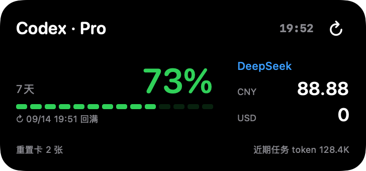 | 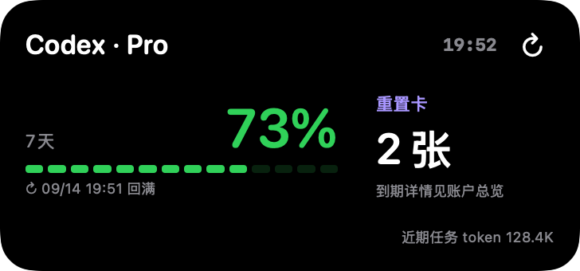 |

大号：之前重置卡挤在额度下方、余额占据右列 → 现在重置卡在额度右侧、余额位于下方。

| 调整前 | 调整后 |
| --- | --- |
| 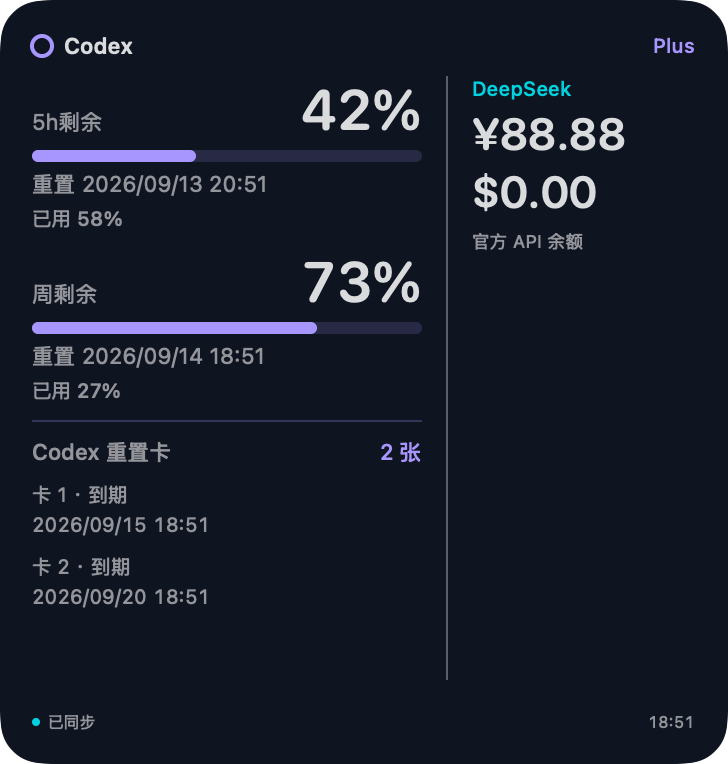 | 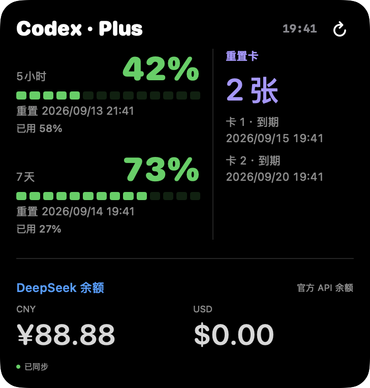 |

[完整尺寸与场景展示](docs/widgets.md) · [Mac 安装说明](macos/README.md)

### 验证与升级说明

- 159 项 Python、74 项 Swift 测试通过，Mac 检查及两端签名构建、安装成功；最新套餐解析增加 Pro Lite 别名回归断言。
- Plus／Pro、有／无 DeepSeek 排版经离屏检查。安装成功不等于实机视觉验收；最终组件选择器和窗口切换仍待用户确认。
- 保留 Mac `CodexUsageWidget` 与 iPhone `CodingQuotaWidget`。此前本地预览的旧 Mac「额度速览」和旧 iPhone「账户总览」入口已移除，相关桌面组件需重新添加一次，配对与 App 数据不变。
- 原有 HTTPS、提醒和审批配置不变；仅使用手机／手表的用户无需安装 Mac 显示模块。刷新由系统调度，不能保证即时更新。
- 来源 Mac 模块依赖非稳定本机接口；账号切换缓存隔离与后台生命周期仍为已知待办，不将本次合并描述为已修复。

## v3.0.1 · Bug 修复 · 2026-09-13 · 更新 11 — 完整项目列表与排序同步

**对比上一正式产品版本：** [v3.0.0 `8c8ff1a`](https://github.com/keeencra/codex-quota-watch-plus/commit/8c8ff1abb70b439d20de70778acf0f127f88313e)。本次为第 12 次有效迭代；[查看版本差异](https://github.com/keeencra/codex-quota-watch-plus/compare/v3.0.0...v3.0.1)。

**分级理由：** 恢复既有的 Mac 项目分组与顺序同步，修正遗漏项目和旧排序覆盖；属于修订号更新，不升级主版本。

### 新增内容

- 无独立新功能。

### Bug 修复

- Codex 项目迁移至新版数据库后，旧全局配置仍可能覆盖数据库的项目顺序及名称；改为使用当前数据库排序，保留置顶顺序，并兼容未迁移的旧版配置。每次请求重新读取，Mac 调整后无需重启服务。
- 之前仅从任务反推分组，无本地 Codex 任务的项目被省略；现在单独同步完整项目列表，手机与手表「全部任务」保留这些分组并显示空状态。不会把 ChatGPT 对话或空项目伪装成正在运行的 Codex 任务。
- 两端按 Mac 项目列表排序，任务活动变化及「进行中与待处理」筛选不会改变项目的相对顺序；未分组任务保留在末尾。

### 改进

- 新接口保留原有任务数组排序，兼容旧客户端；新客户端也兼容无项目列表字段的旧服务。项目清单只包含 ID 与名称，不包含目录路径。

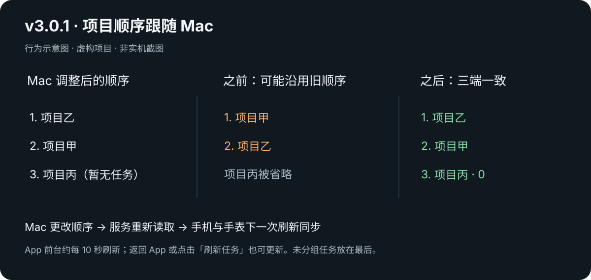

### 验证与升级说明

- 152 项 Python、72 项共享 Swift 测试通过；手机与手表签名构建通过。覆盖空项目、迁移前后排序、置顶／取消置顶、连续请求重读、旧接口兼容及活动筛选。源码与安装方式见[版本下载](docs/downloads.md)。
- 本地 Mac 服务已更新，手机与手表安装回执均成功；最终真机显示待所有者查看。
- 更新 Mac 服务及两端 App。App 前台约每 10 秒自动刷新，重新打开 App 或点击「刷新任务」也会更新；不承诺 App 后台持续刷新。旧客户端可接收任务顺序修复，完整空项目展示需要新版客户端。

## v3.0.0 · 大更新 · 2026-09-13 · 更新 10 — 码伴品牌与 DeepSeek 余额

**对比上一正式产品版本：** [v2.0.0 `e878afd`](https://github.com/keeencra/codex-quota-watch-plus/commit/e878afd33fe09d50f8b329b14717b43584cbb8b2)；上一版文档补充截止 `366c202`。本次为第 11 次有效迭代。

### 新增内容

- 项目以「码伴 · CodeCompanion」品牌维护，统一手机、手表和小组件名称与绿黄额度环图标。手机新增「关于码伴」，明确 Mac＋iPhone 即可使用、Apple Watch 可选。
- 手机、手表和小号／中号小组件接入 DeepSeek API 账户余额；分币种显示总余额、充值余额、赠送余额、可用状态和采集时间。API Key 仅保存在 Mac，通过本地隐藏输入配置。
- 项目首页加入本版完整界面图库，覆盖 Plus／Pro、有／无 DeepSeek、小号／中号组件、正常／空列表／查询失败等情况。图为原生界面的虚构数据演示，不代表新添了所有被展示的功能。

### Bug 修复

- 修复手表首页品牌图标因资源加载方式不匹配而空白，改为从已打包的独立图片资源读取。
- 本地接入 DeepSeek 后，小号组件一度丢失 Codex 进度条；恢复每个额度窗口的分段条。
- 修复双余额内容集中顶部、下方留白过多；重新分配各区域间距。修复小号双窗口挤掉底部刷新时间的问题。
- 未配置 DeepSeek 时自动恢复 Codex 专用布局，保留重置时间及中号今日 token 用量图；配置后的零余额和临时查询失败不切换版式。
- 修正将手表描述为必需设备的连接与通知文案；无配对手表时跳过 WatchConnectivity 转发，手机功能继续独立工作。

### 改进

- DeepSeek 查询有独立超时，失败不影响 Codex；金额按字符串传输，币种不相加，未配置／失败不显示成零余额。兼容无新增字段的旧快照。
- 手机、手表分开打包的图标统一来自同一母版，并增加一致性检查。保留签名标识、App Group、Keychain、配对协议及现有用户数据。
- 保留原仓库地址 `keeencra/codex-quota-watch-plus`，首页注明旧名称，方便小红书旧帖访客继续找到项目；许可证与上游致谢保留。

### 改动演示

旧版以 Codex Quota 展示额度；新版统一码伴品牌，手机／手表增加 DeepSeek，组件按配置分两套布局。

| 新品牌与手机独立使用 | 手机 DeepSeek 详情 | Pro 双余额小组件 |
| --- | --- | --- |
|  |  |  |

以上均为 v3.0.0 原生视图在隔离模拟器中渲染，使用虚构数据；小组件为固定尺寸宿主展示，非桌面截图。所有情况见[完整图库](docs/gallery.md)。

### 验证与升级说明

- 149 项 Python、70 项共享 Swift 测试通过；公开 iPhone 模拟器独立构建、手机／手表图库构建、私有签名构建通过。已检查图标打包、两套组件布局、手机和手表安装成功回执。
- 用户此前已确认手机、手表、小组件均能显示真实 DeepSeek 余额；码伴最终图标与布局已安装，真机视觉效果待用户查看。图库不代替真机端到端验收。
- Mac 更新 Python 包后重启服务；使用自己的签名更新 iPhone，Apple Watch 用户可同时更新手表。已有配对信息兼容，DeepSeek 为可选配置。
- 所有者指定将本次实际产品更新编号为 v3.0.0；旧文档误发的撤回 Release 与标签已清理，误发不计入迭代。此前下载过误发源码的用户，请重新下载本次正式 v3.0.0；v2.0.0 及更早有效版本保持不变。

### 文档与维护补充 · 2026-09-13（版本分级调整，不升版本）

- **对比本版原发布规则**：由“任意新增功能升第一位、中间位固定为 0”改为三级编号；重大升级升主版本，常规兼容功能／局部改进升次版本，Bug 修复升修订号。
- **新增内容**：新增版本管理文档，给出重大升级门槛、项目具体例子、混合改动与数字进位规则。产品新增功能：无。
- **Bug 修复**：无 App／Mac 产品 Bug 修复；纠正维护规则中主版本增长过快的分类方式。
- **改进**：同步维护约定、首页、下载说明及长期维护计划；要求记录分级理由，同一批相关改动统一发布，默认从严判断。
- **验证与升级说明**：检查文档链接、规则一致性与 Git 差异；未修改产品代码，当前仍为 v3.0.0、第 11 次有效迭代。无需重新构建、签名或安装，不改写历史版本与已发布下载包。本次没有界面变化，无需配图。

## v2.0.0 · 大更新 · 2026-09-13 · 更新 9 — 手表导航修复与长期维护

**对比上一版：** [v1.0.0 `6ee2638`](https://github.com/keeencra/codex-quota-watch-plus/commit/6ee263839d0ff5a76a28220768b2d920adeaa580)。第 10 次迭代；保留已确认的版本号与历史分类，后续按下方修订后的规则发布。

### 新增内容
- 增加长期维护计划，明确每周检查范围、修复与发布流程、真机验证和维护记录要求。

### Bug 修复
- 修复手表首页进入任务、待审批或额度后，仍可横向滑到相同额度与今日用量页的问题：将导航栈移到首页分页外层，保留首页的「总览、额度、今日用量」三页；进入任务、待审批或额度详情后只显示对应内容，不再带着首页后两页。
- 修复手表额度页的 Codex / 套餐标题与返回按钮重叠：去除旧分页沿用的负顶部偏移，标题移入右侧导航栏，正文回到安全区域内。
- 统一手表任务、待审批、额度和详情页的左上角返回按钮，返回当前导航的上一页；首页三页仅靠左右滑动切换，不显示返回按钮。仅手表端应用此设置，iPhone 继续使用原有导航。

### 改动图解

**进入功能后不再出现重复分页。** 首页仍有「总览、额度、今日用量」三页；点击任务、待审批或额度入口后，只显示对应功能。

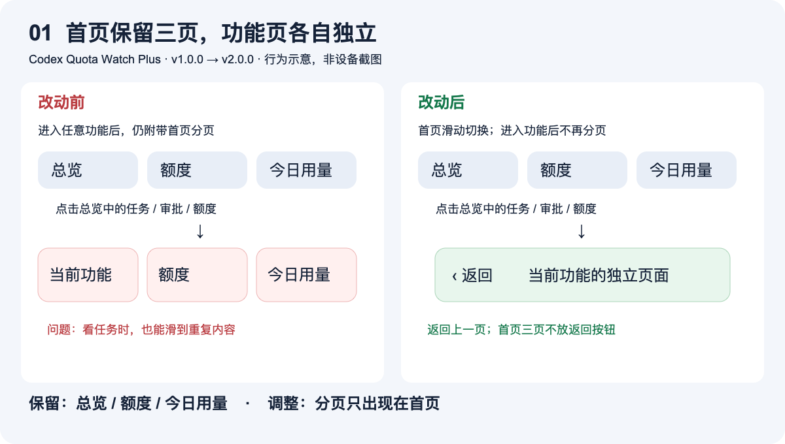

**额度标题避开返回按钮。** 功能页左侧返回、右侧显示 Codex / 套餐；首页三页不显示返回按钮，依靠滑动切换。

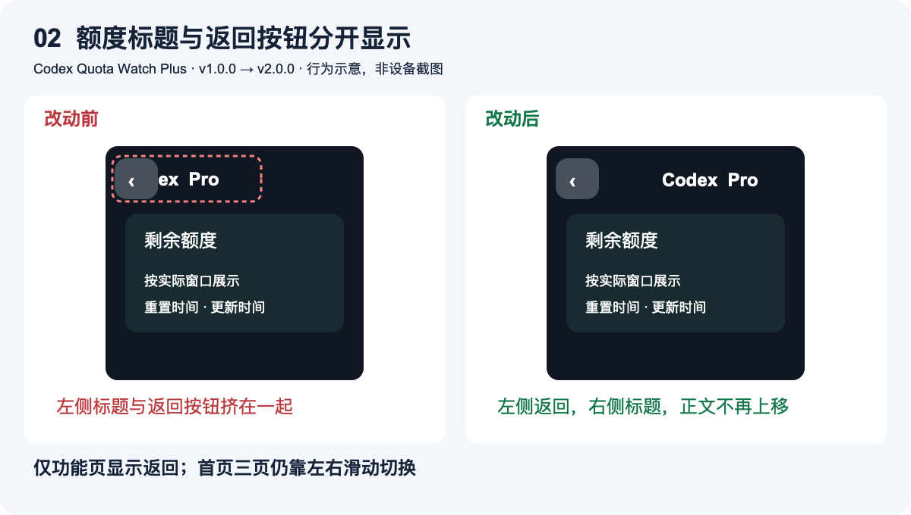

*以上为本项目 v1.0.0 → v2.0.0 的行为／布局示意，非设备截图；于 2026-09-13 补充，仅完善本版说明，不改变 App 或版本号。可编辑源图：[导航](docs/assets/v2-navigation-comparison.svg) · [标题](docs/assets/v2-header-comparison.svg)。*

### 改进
- 在项目维护约定中加入长期维护入口，沿用已有自动续签流程。

### 验证与升级说明
- 公开工程与本地部署工程的三处 Swift 修改一致；133 项 Python 测试、66 项共享 Swift 测试、公开工程无签名 Xcode 构建及私有部署签名构建通过，公开内容敏感模式扫描与脚本语法检查通过。
- 已更新 iPhone（含小组件）与 Apple Watch，两个设备的安装成功回执均已确认，保留原应用标识和配对数据。手表初次安装遇网络连接超时，在恢复同一 Wi-Fi 连接后重试成功；界面和返回行为的真机交互仍待用户验收。
- 使用自己的签名重新构建并更新 iPhone 与 Apple Watch；无需改变 Mac 服务、HTTPS、通知或审批配置。源码下载不包含个人签名和配对信息。

### 文档与维护补充 · 2026-09-13（不升版本）

- 补充上方两张导航与标题的前后对比示意图，保留文字、替代文字及 SVG 源文件；建立后续界面更新配图规范。
- 更正本次误升版本的记录：产品仍为 **v2.0.0、第 10 次迭代**；仅文档更新不再升版本。误发的 v3.0.0 发布说明标记为撤回，不作为有效产品版本。
- 图片已静态渲染核查，SVG、文档链接与版本信息已检查。没有 App／Mac 运行代码变化，无需重新签名、安装或修改配置；不新增真机验收结论。

## 版本索引

当前项目版本 **v3.3.2 · Bug 修复 · 第 18 次迭代**。历史 v0.1.0～v0.8.0 使用旧编号并保持不变，下表按内容补充更新类型；前 5 个编号由已有日志追溯补齐，不代表当时已有同名标签或 Release。

### 版本号规则

采用 `v主版本.次版本.修订号`，2026-09-13 按所有者最新要求收紧主版本升级门槛。完整判断标准与发布流程见 [版本号与发布规则](docs/versioning.md)。

- **大更新（第一位）**：必要的不兼容升级、核心使用方式实质扩展，或整体核心流程重大改版；例如 `v3.4.2 → v4.0.0`。须在日志中写明重大变化与分级理由，不能把普通新增功能算作大更新。
- **小更新（第二位）**：兼容的新功能、局部界面和交互改进；例如 `v3.0.2 → v3.1.0`。常规功能同时修 Bug 仍按小更新。
- **Bug 修复（第三位）**：修复缺陷、恢复既定行为；例如 `v3.1.0 → v3.1.1`。进度条消失、标题遮挡、错误分页、同步失败等均属于此类。
- **不升版本**：日志、介绍、截图、宣传材料、维护规则，以及不改变产品行为的内部重构、测试与构建检查；并入所属版本的“文档与维护补充”，不新增有效迭代、标签或 Release。
- 默认从严判断，不依据提交次数、文件数量或累计小功能数量升主版本。数字可以超过 9，不因 `3.9.x` 自动跳到 `4.0.0`；提高某一位时仅将其右侧归零。
- 只有有效产品发布才累计一次迭代。历史 v0.1.0～v3.0.0 的编号、分类、累计 11 次记录、标签和源码包保留；过去的文档误发不计数，历史条目中的旧规则不再作为后续发布依据。

| 迭代 | 项目版本 | 更新类型 | 日期 | 主要变化 |
| --- | --- | --- | --- | --- |
| 18 | v3.3.2 | Bug 修复 | 2026-09-15 | 侧栏分区与混合任务排序，iOS 26／27 兼容验证 |
| 17 | v3.3.1 | Bug 修复 | 2026-09-15 | 归档重读、日志积压与跨轮次停滞误报修复 |
| 16 | v3.3.0 | 小更新 | 2026-09-15 | Mac 每日 token 趋势与统一滚动面板 |
| 15 | v3.2.1 | Bug 修复 | 2026-09-14 | Mac 面板公历日期修复 |
| 14 | v3.2.0 | 小更新 | 2026-09-13 | 大号居中与倒计时、菜单栏双币种修复 |
| 13 | v3.1.0 | 小更新 | 2026-09-13 | Mac 显示端、统一组件、重置卡及套餐／统计修复 |
| 12 | v3.0.1 | Bug 修复 | 2026-09-13 | 完整项目列表、空项目显示、Mac 排序同步 |
| 11 | v3.0.0 | 大更新 | 2026-09-13 | 码伴品牌、手机优先、DeepSeek 余额与双布局组件 |
| 10 | v2.0.0 | 大更新 | 2026-09-13 | 手表导航修复与长期维护计划 |
| 9 | v1.0.0 | 大更新 | 2026-09-12 | 大／小更新分类与版本规则 |
| 8 | v0.8.0 | 大更新 | 2026-09-12 | 结束提醒显示项目名与任务标题 |
| 7 | v0.7.0 | 大更新 | 2026-09-12 | 所有版本下载与 Release 入口 |
| 6 | v0.6.0 | 大更新 | 2026-09-12 | 版本编号、版本索引及发布规范 |
| 5 | v0.5.0 | 大更新 | 2026-09-12 | Codex 项目分组与侧栏任务标题同步 |
| 4 | v0.4.0 | 大更新 | 2026-09-12 | 界面图库与功能导览 |
| 3 | v0.3.0 | 小更新 | 2026-09-12 | 修复 iPhone 总览三个入口跳转 |
| 2 | v0.2.0 | 大更新 | 2026-09-12 | 任务总览与逐项远程审批 |
| 1 | v0.1.0 | 大更新 | 2026-09-11 | 首次公开功能汇总 |

全部版本的固定源码下载入口见 [所有版本下载](docs/downloads.md)。

## v1.0.0 · 大更新 · 2026-09-12 · 更新 8 — 区分大更新与小更新

**对比上一版：** [v0.8.0 `a7e2919`](https://github.com/keeencra/codex-quota-watch-plus/commit/a7e2919e087df0c656515a75be8455547e89a8b5)。

### 新增内容

- 新增大更新／小更新的项目版本规则，首页、版本索引与下载列表显示更新类型。
- 为历史 8 个版本补充类型，保留既有版本号、标签和下载链接。

### Bug 修复

- 无新增 App Bug 修复，本次为版本规则及文档内容更新。

### 改进

- 迭代次数与版本号分开维护；新增内容按主版本递增，仅修 Bug 按修订号递增。
- 明确混合更新、必要修复文档和回归测试的分类，避免后续编号不一致。

### 验证与升级说明

- 核对首页、VERSION、日志及下载列表的版本／类型／累计次数一致，检查文档链接、历史下载映射和 Git 差异；发布后验证版本源码包及远端内容。
- 没有 App 或 Mac 服务代码变化，无需重新签名或安装。v1.0.0 是新编号规则的起点，不表示新增了兼容性或稳定性保证。

## v0.8.0 · 2026-09-12 · 更新 7 — 按项目与任务区分结束提醒

**对比上一版：** [v0.7.0 `105aaf7`](https://github.com/keeencra/codex-quota-watch-plus/commit/105aaf7f5581cafdadb96f3cc3a88522871081b3)。

### 新增内容

- 可开启「项目名 · 任务标题 · 本轮已结束」，Bark 与 ntfy 共用同一套身份匹配逻辑。
- 按结束事件所属会话读取 Codex 侧栏项目与标题；名称不可用时使用项目短名和任务短标识回退。

### Bug 修复

- **多任务提醒无法区分：** 多个任务同时结束时，此前都显示「Codex 本轮已结束」，即使附带目录名，同项目任务仍无法识别；开启新选项后显示对应项目与任务标题。

### 改进

- 发送和重试时读取最新侧栏名称，不依赖当前活跃任务；保留原有去重、过期和静音设置。
- 更新通知数据说明与启用步骤；标题只在开启选项时发送，不新增写入事件数据库或额度缓存。

### 验证与升级说明

- 133 项 Python 测试通过；新增测试覆盖两个并行任务、Bark／ntfy、去重、重试改名、缺失名称、长标题与默认关闭行为。
- 个人 Mac 后端已安装并重启通知服务，新选项已开启；使用本机元数据核对实际项目与任务标题。模拟投递测试不等于设备已收到新样式通知，设备展示需由后续真实任务结束确认。
- 只需更新 Mac Python 包、重启通知服务并启用 `include_task_identity`；iPhone／Watch App 无需重新安装。公开配置默认保持状态提醒。

## v0.7.0 · 2026-09-12 · 更新 6 — 所有版本下载入口

**对比上一版：** [v0.6.0 `b868fb5`](https://github.com/keeencra/codex-quota-watch-plus/commit/b868fb5ce06917ea4214558357b4113343ac796d)。

### 新增内容

- 新增所有版本下载页面，为历史 v0.1.0～v0.6.0 提供固定提交源码 ZIP。
- v0.7.0 提供同名 Git 标签和 GitHub Release；首页与更新日志增加下载导航。

### Bug 修复

- 无新增 App Bug 修复；本次为版本分发入口与文档更新。

### 改进

- 区分固定版本下载与持续变化的 main 下载，说明源码构建、签名及历史版本配套要求。
- 发布规范补充下载映射、固定版本入口及下载可用性检查。

### 验证与升级说明

- 核对历史版本对应提交，检查源码 ZIP 响应和文件格式、版本号一致性、文档链接及 Git 差异；发布后验证当前版本下载和远端内容。
- 无运行代码变化，已安装的手机、手表和 Mac 服务无需升级。

## v0.6.0 · 2026-09-12 · 更新 5 — 版本编号与迭代索引

**对比上一版：** [v0.5.0 `330c9b0`](https://github.com/keeencra/codex-quota-watch-plus/commit/330c9b0)。

### 新增内容

- 新增 `VERSION` 文件记录当前项目版本，README 顶部显示版本号和累计迭代次数。
- 为已有 5 个发布阶段补充连续版本号，并新增版本索引表，方便对照每次变化。

### Bug 修复

- 无新增 App Bug 修复；本次为版本记录与文档更新。

### 改进

- 将每次 GitHub 发布递增版本号、同步首页与日志写入维护规范；保留旧日期和更新序号，方便对照历史记录。

### 验证与升级说明

- 核对版本编号连续、VERSION 与 README／日志一致、文档链接有效，并检查 Git 差异格式及公开内容；发布后核对远端文件一致。
- 本次不改运行代码、App 签名或 Python 包版本，已安装用户无需重新安装。

## v0.5.0 · 2026-09-12 · 更新 4 — 按 Codex 项目分组并同步任务标题

**对比上一版：** [更新 3 `3d35e0e`](https://github.com/keeencra/codex-quota-watch-plus/commit/3d35e0e9c828ae3b2306a414e9ac769f34258fdc)。

### 新增内容

- 手机与手表任务列表按 Codex 项目分组，并显示每组任务数量；同名项目使用独立标识，不混到一起。
- 默认展示本机全部未归档任务，保留「进行中与待处理」筛选；没有采集到活动的任务标注「尚未监测」。
- 只读同步 Codex 原生项目归属，兼容桌面旧版的项目分配及目录匹配；项目和任务名称在刷新时更新。
- 更新手机任务列表截图，新增手表项目分组截图与使用说明，均使用虚构演示数据。

### Bug 修复

- **标题与侧栏不一致：** 此前仅读默认 `title`，用户重命名后仍可能看到最初的提示词／链接；现在优先读侧栏的 `name`，回退默认标题。标题缺失时显示带短标识的未命名任务。
- **项目归属不准确：** 此前只用工作目录最后一级作为项目名，任务移动到 Codex 项目或运行在工作树时容易分错；现在优先使用显式项目归属。
- **旧任务残留：** 此前旧活动记录可能继续显示已经归档或移除的任务；本机任务目录可读取时过滤这些记录，元数据不可用时才使用活动记录回退。

### 改进

- 已存在但尚未观察到活动的任务也可在列表中识别；它们不会被推断为运行中或已结束。
- 项目分组参考本机侧栏项目顺序，组内按最近活动／任务更新时间排序；只显示有可见任务的项目。
- 项目名、标题和归属只经认证任务接口送到自己的 App；不返回工作目录，不写入额度缓存或推送。

### 验证与升级说明

- Python 测试覆盖重命名、旧版归属、同名项目、目录边界、未监测状态、归档与删除过滤、元数据损坏回退；Swift 测试覆盖分组、筛选、标题和旧接口兼容。
- 124 项 Python 测试与 66 项 Swift 测试通过，个人签名构建通过；在本机认证接口核对了实际侧栏标题与项目归属。
- 模拟器验证分组、标题、进行中筛选及任务详情跳转；新版已安装并启动到个人 iPhone 与 Apple Watch，Mac 网关已更新。本地数据接口升级后仍需复验兼容性，不代表支持其他主机或云端项目。
- 更新 Mac 后端、重新安装 Python 包并重启 HTTPS 网关；重新构建和安装 iPhone／Watch App。通知服务不需要为项目显示重新配置。

## v0.4.0 · 2026-09-12 · 更新 3 — 界面图库与功能导览

**对比上一版：** [更新 2 的主分支提交 `8b20906`](https://github.com/keeencra/codex-quota-watch-plus/commit/8b20906ff1a0fc262eaea970882daa631f4951e9)。本轮为文档与展示更新，App 运行代码沿用上一版。

### 新增内容

- 新增 9 张本项目模拟器界面截图：手机总览、任务列表、任务详情与审批详情，以及手表总览、任务进展、待审批列表、审批详情与额度页。
- README 增加界面图库、从 Mac 开始任务到手表处理审批的使用流程，以及手机／手表／Mac 功能对照表。
- 新增 [界面与功能导览](docs/feature-tour.md)，说明三个入口、任务筛选、审批步骤、额度、小组件、通知与外网使用条件。
- 新增仓库维护规范，要求今后每次同步说明比较基线、新增内容、Bug 修复和验证结果。

### Bug 修复

- **无新增 App Bug 修复。** iPhone 三个入口的导航修复已在上一版发布，见下方更新 2；本轮继续包含该修复。

### 改进

- 此前首页主要是文字与一张示意横幅；现在可以直接对照手机和手表截图了解实际操作。
- 将此前同一天混合记录的功能更新与导航修复拆开，补充旧表现／新表现及历史比较链接。
- 所有新截图明确标注模拟器与虚构演示数据，不使用个人任务、Token 或借鉴项目的截图。

### 验证与升级说明

- 演示构建在 iOS / watchOS 26.5 模拟器运行，逐页核对截图与实际页面；审批数据在展示构建中只读，不执行真实命令。
- 检查文档本地链接、图片完整性及 `git diff --check`；发布前后核对 Git 文件内容一致。
- 本轮不改 App 或 Mac 服务代码；上一版已安装的用户无需重新签名或安装。演示构建只用于截图，不安装到实体设备。

## v0.3.0 · 2026-09-12 · 更新 2 — 修复 iPhone 总览跳转

**对比上一版：** [`bf05152` → `8b20906`](https://github.com/keeencra/codex-quota-watch-plus/compare/bf05152a7338bb2f410b4e416c7067a640bf7d18...8b20906ff1a0fc262eaea970882daa631f4951e9)。

### 新增内容

- 无新增功能。

### Bug 修复

- **触发条件：** 在 iPhone 总览点击「运行中」「待审批」或「剩余额度」。
- **之前：** 三个 NavigationLink 放在同一个 Form 行中，点击区域相互干扰，三个入口都可能进入剩余额度页。
- **现在：** 每个入口各占独立表单行，「运行中」进入任务列表，「待审批」进入审批列表，「剩余额度」进入额度详情。

### 改进

- 保留三种卡片颜色与分组外观，隐藏组内分隔线；手表原有独立跳转不变。

### 验证与升级说明

- 在 iPhone 模拟器逐项点击，确认分别显示「任务」「待审批」「剩余额度」。
- iOS 模拟器构建和个人签名构建成功；修复版已安装并启动到项目所有者的 iPhone。模拟器路由验证不代表所有真实审批请求均已端到端测试。
- 使用旧版的其他用户需要重新构建并安装 iPhone App；Mac 服务无需因这项导航修复重启。

## v0.2.0 · 2026-09-12 · 更新 1 — 任务总览与逐项远程审批

**对比上一版：** [`f6bdab0` → `bf05152`](https://github.com/keeencra/codex-quota-watch-plus/compare/f6bdab02cf9cd1bb8988b977ce8c3f256534fe22...bf05152a7338bb2f410b4e416c7067a640bf7d18)。

### 新增内容

- **任务总览首页**：手机与手表集中显示运行中任务、实时待审批及剩余额度，分别进入详情。
- **任务详情**：显示任务标题、项目、实际活动阶段、状态与最近五次阶段变化；支持进行中／全部任务筛选。
- **独立任务接口**：新增认证 `/tasks`，按会话取最新一轮统计，不再依赖额度快照中的最近十条记录；过旧状态单独提示。
- **逐项远程审批**：接入适用的桌面原生命令审批与 `PermissionRequest` Hook，手机／手表查看完整操作后批准本次或拒绝本次。
- **审批生命周期保护**：一次性凭据与操作指纹校验，等待进程心跳、到期失效、消费回执及重复提交处理；不提供永久允许或离线批准。
- **提醒补充检查**：增量日志观察器与 Hooks 去重，补充结束、中断和等待回复状态；长时间无活动时提醒可能停滞。
- **项目名提醒选项**：可在通知标题附上项目目录名，继续使用静音推送。
- **项目首页与更新日志**：以本项目的任务、审批、额度及外出使用场景重写 README，加入独立绘制的功能示意图与文档导航。

### Bug 修复

- **超长日志行阻塞：** 工具结果超过单次读取预算时，观察器可能停在同一位置；改为分块跳过超长行，再继续读取后续任务事件。
- **任务标题缺失：** `CODEX_HOME` 使用 `~` 路径时无法定位日志；展开用户目录并规范化路径后可读取标题。

### 改进

- 手机将配对、通知和诊断设置折叠收纳，统一首页入口。
- 调整手表卡片间距，使 Ultra 尺寸首页可同时显示三项总览；改善手机浅色模式对比度及导航箭头。
- 连接失败显示未知数量并提示旧记录，避免把缓存状态当成实时运行数。
- 任务标题与审批详情不进入额度缓存、小组件和推送；阶段使用固定活动描述。

### 验证与升级说明

- 发布检查通过：118 项 Python 测试、64 项 Swift 测试及未签名 Xcode 构建。

1. 更新 Mac 后端，重新安装 Python 包，重启任务通知进程与 HTTPS 网关。
2. 用 Xcode 重新构建、签名并安装 iPhone／Watch App。
3. 基础额度配对不能自动启用所有任务功能，请按 [任务总览](docs/task-dashboard.md) 和 [远程审批](docs/remote-approval.md) 配置。

远程审批目前支持范围有限，原生文件变更审批、文字问答等仍需在 Mac 处理；Codex 升级后需要复验本机接口兼容性。任务结束表示一轮处理结束，不等于整个项目完成。

## v0.1.0 · 2026-09-11 — 首次公开功能汇总

**比较基线：** 此前公开代码的首次汇总。本次按已有发布阶段追溯编号为 v0.1.0，不补造更早的发布记录。

### 新增内容

- Plus / Pro 等套餐标签与实际额度窗口识别。
- 认证 HTTPS 网关与固定 ngrok 地址部署，支持外网读取额度。
- iPhone、Apple Watch 额度同步，以及手机小号／中号小组件独立刷新与离线缓存提示。
- Codex Hooks 任务记录，Bark 静音提醒及 ntfy 兼容；推送失败重试与过期处理。
- 自动签名检查及续签安装工具、私有配置模板和定时运行说明。
- 清理个人部署配置后公开源码，保留 AGPL-3.0 及任务通知相关 MIT 声明。

### Bug 修复

- 额度窗口显示：按实际返回的窗口渲染，避免仅依据套餐名称推断限制。
- 小组件刷新：加入独立读取与刷新入口，缓解只依赖手机 App 缓存造成的旧数值展示；后台更新时间仍由系统安排。

### 改进

- 默认使用 Bark 静音通知，保留通知镜像与状态展示。

### 验证与升级说明

- 此条目整理自当日已公开的代码与提交记录；具体功能验证见对应提交与部署文档，不补写无法核实的测试结果。
- 首次使用按 README 安装 Mac 服务，并构建、签名、安装手机和手表 App。
