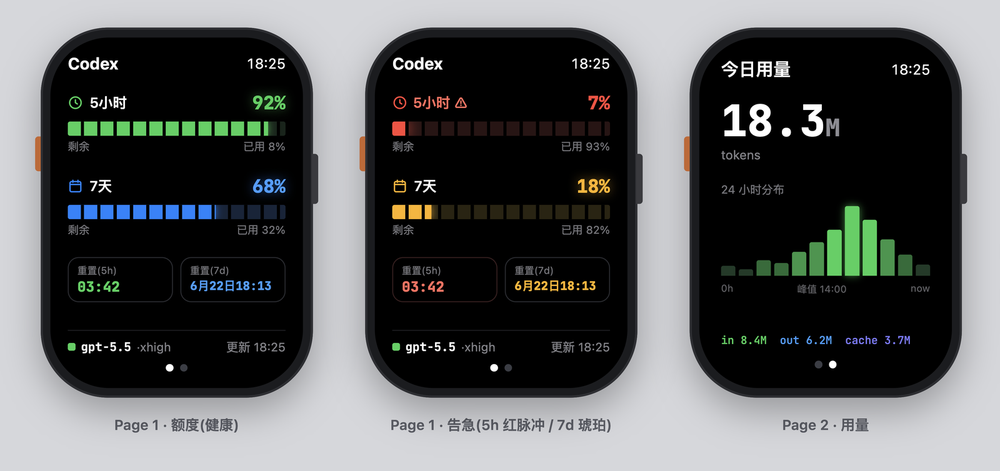
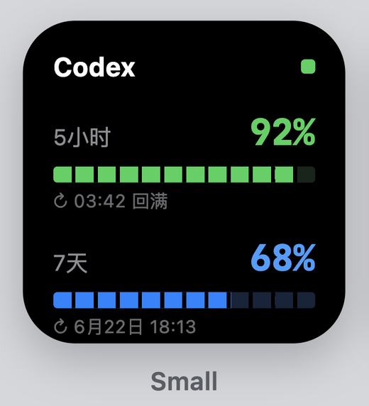
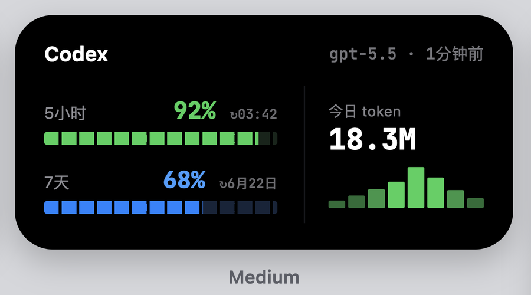
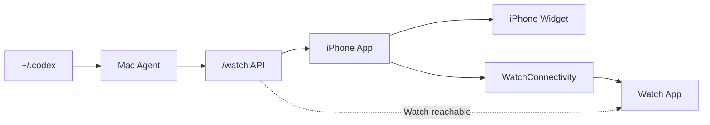

# Codex Quota Watch Plus

<p align="center">
  
</p>

<table>
  <tr>
    <td align="center" width="35%">
      
    </td>
    <td align="center" width="65%">
      
    </td>
  </tr>
</table>

把 Mac 上的 Codex 额度和任务状态带到 iPhone、Apple Watch 与桌面小组件，并用 Bark 接收任务结束、需要确认的通知。

本仓库基于 [cyq1017/codex-quota-watch](https://github.com/cyq1017/codex-quota-watch) 改进，任务提醒参考 [H1234L1/codex-watch-notifier](https://github.com/H1234L1/codex-watch-notifier)。这是社区改进版，非 OpenAI 或 Apple 官方产品。

## 本版新增

- **套餐与额度窗口识别**：显示 Plus / Pro 等套餐标签；只展示接口实际返回的窗口，不把缺失的 5 小时窗口伪造为周额度。
- **外网访问**：独立的认证网关可配合 ngrok 固定 HTTPS 地址使用，外出仍能读取额度和任务状态。
- **小组件独立刷新**：小组件可自行请求最新额度，网络失败时保留旧数据并标记未更新。实际刷新频率由 iOS 调度。
- **任务记录**：通过 Codex Hooks 记录进行中、需要确认、本轮结束和中断；手机与手表随额度同步显示。
- **Bark 静音提醒**：手机内保存 Bark 地址，Mac 发送固定状态通知；保留 ntfy 兼容。推送不包含原始任务、命令、完整文件路径或回复。

首次安装先按下方基础步骤完成配对，再阅读 **[远程访问与任务提醒设置](docs/enhancements.md)**。公开源码已使用示例 Bundle ID，不包含部署者的密钥、域名、签名和设备配置。

本项目以 AGPL-3.0 开源，欢迎个人学习、使用和贡献。



## 适合谁

适合已经在 Mac 上使用 Codex，并愿意用 Xcode 把一个开源示例 App 安装到自己 iPhone 和 Apple Watch 的用户。

这不是 App Store 产品，也不是免 Xcode 安装包。Apple ID 登录、Team 选择、设备信任、Developer Mode 和签名确认仍然需要你自己点。

## 让 Codex 带你安装

推荐新手直接把下面这句话发给本机 Codex：

```text
请在 /Users/<你的用户名>/codex-quota-watch 按 README 和 docs/setup.md 带我安装 Codex Quota 到我的 iPhone 和 Apple Watch。不要打印 WATCH_TOKEN、agent/.env、Apple Team ID、签名证书或 provisioning profile。遇到 Xcode 登录、Team、设备信任、Developer Mode、watchOS platform 缺失时停下来告诉我具体点哪里。
```

也可以复制完整部署提示词：

- [Codex 本机部署 prompt](docs/codex-deploy-prompt.md)

## 手动三步开始

1. 安装并启动 Mac Agent：

```bash
scripts/install-launch-agent.sh --lan
```

2. 配置 iOS 标识并打开 Xcode：

```bash
scripts/configure-ios-identifiers.sh --bundle-id com.yourname.CodexQuota
open ios-watch/CodingQuota.xcodeproj
```

在 Xcode 里给三个 target 选择同一个 Apple Team：

```text
CodingQuota
CodingQuota Watch App
CodingQuotaWidgetExtension
```

然后选择你的实体 iPhone 运行 `CodingQuota` scheme。Watch App 会作为 companion Watch App 安装到已配对的 Apple Watch，iPhone Widget 会随 iPhone App 安装。

3. 打开配对二维码：

```bash
scripts/show-pairing-qr.sh --open-html
```

iPhone App 点 `Scan Pairing QR`，扫浏览器页面里的二维码，扫码后点 `Fetch & Sync to Watch`，再打开 Watch App `Codex Quota`。二维码包含 `WATCH_TOKEN`，不要截图公开。

## 现在能看什么

- Codex 实际返回的额度窗口、剩余额度、已用比例与重置时间。
- Codex 今日 input / output / cache token 摘要。
- Apple Watch 打开时主动刷新；失败时显示最近一次 iPhone 同步快照。
- iPhone small / medium Widget 独立刷新，失败时显示最近缓存及未更新标记。

## 本次发布范围

- 包含 Mac Agent、认证远程网关、任务通知进程、iPhone／Watch App 和 iPhone 小组件。
- 任务快照包含项目目录名、状态和时间，不包含原始提示词、命令、完整路径或回复。
- 不提交 `agent/.env`、真实 token、`~/.codex`、cookies、Apple Team ID、签名证书或 provisioning profile。

## 重要边界

- `WATCH_TOKEN` 必需；二维码或 token 泄露后运行 `scripts/rotate-watch-token.sh --restart-launch-agent`。
- 原 Mac Agent 仅用于本机或可信网络，公网访问使用单独的 8788 认证网关和 HTTPS 隧道。
- Personal Team 真机安装通常 7 天后会过期，需要用 Xcode 重新安装。
- Watch 直连只在 Watch 能访问 Mac Agent URL 时生效；否则显示最近快照并请求 iPhone 同步。
- iPhone Widget 可独立请求数据，但刷新频率由 iOS 调度，不保证实时。

## 文档

- [完整安装](docs/setup.md)
- [Xcode 真机安装演示](docs/xcode-device-install.md)
- [Codex 本机部署 prompt](docs/codex-deploy-prompt.md)
- [真机检查清单](docs/device-checklist.md)
- [架构和刷新频率](docs/ARCHITECTURE.md)
- [常见问题](docs/troubleshooting.md)
- [安全说明](SECURITY.md)

## 开发检查

```bash
(cd agent && python3 -m pytest)
swift test --package-path ios-watch
scripts/check-public-ready.sh --worktree
```

## License


AGPL-3.0 © 2026 从野秦。

商用或闭源集成需单独获得作者授权。
