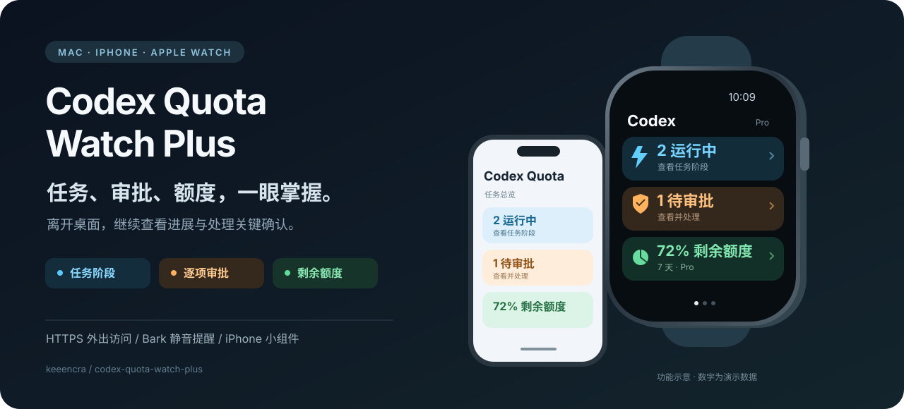
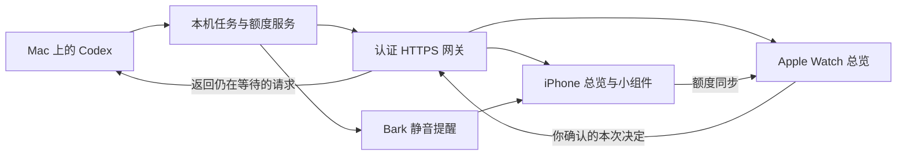

<div align="center">

# Codex Quota Watch Plus

### 离开电脑，也能知道 Codex 跑到哪一步。

任务进展 · 手表审批 · 额度监控 · 静音提醒

[开始部署](#开始部署) · [更新日志](CHANGELOG.md) · [功能文档](#功能文档) · [反馈问题](https://github.com/keeencra/codex-quota-watch-plus/issues)



*功能示意图，数字为演示数据。*

</div>

Codex Quota Watch Plus 是一套运行在 **Mac、iPhone 和 Apple Watch** 上的个人 Codex 监控工具。Mac 收集本机任务和额度，手机与手表展示状态；遇到支持的审批请求，可以查看完整操作后，直接在手表上批准本次或拒绝。

它适合已经使用 Mac 运行 Codex，希望在离开桌面时仍能掌握任务进展的人。项目由 **keeencra** 持续维护，包含原生 SwiftUI App、iPhone 小组件、Python 后端及部署脚本。

## 打开手表，先看三件事

| 首页卡片 | 你能看到什么 | 点进去可以做什么 |
| --- | --- | --- |
| 🔵 **运行中** | 已跟踪的运行任务数量，另列需要关注的任务 | 查看任务标题、当前阶段、状态和最近事件 |
| 🟠 **待审批** | 仍在等待你决定的实时审批数量 | 查看完整操作，批准本次或拒绝本次 |
| 🟢 **剩余额度** | Codex 实际返回的剩余额度 | 查看各额度窗口、重置时间和套餐信息 |

任务阶段来自实际活动，例如“正在分析”“正在执行工具”“正在整理回复”，不会猜测完成百分比。过旧状态会标记待确认；连接失败时显示未知数量，避免把旧数据当成实时状态。

手机首页使用相同的三项总览。配对、通知与诊断设置可展开查看；手表左右滑动仍可进入完整额度和今日用量页面。

## 从查看状态，到处理关键节点

**任务进展与提醒。** Hooks 与增量日志观察器共同记录运行、等待回复、结束和中断等状态，并去重。活动任务约 10 分钟没有新事件时，可发送“可能停滞”提醒。Bark 默认为静音通知，保留 ntfy 兼容；Apple Watch 可镜像手机通知。

**手表远程审批。** 支持已接入的桌面原生命令审批和 `PermissionRequest` Hook。每次展示具体操作，再由你确认；请求过期、失去等待进程或任务结束后失效。不会自动批准，也不会把批准扩展为永久授权。原生文件变更审批和文字问答等仍需在 Mac 处理，详见 [审批支持范围](docs/remote-approval.md)。

**额度与小组件。** 显示 Plus / Pro 等套餐标签、可用额度窗口、重置时间，以及今日输入、输出和缓存 token。只展示数据源实际返回的窗口。iPhone 小号、中号小组件可独立刷新额度；系统决定后台刷新时机，网络失败时保留缓存并提示未更新。

**外出访问。** 使用认证 HTTPS 网关与 ngrok 固定地址，手机／手表通过互联网访问 Mac，无需一直处于同一局域网。Mac 仍需开机、联网并运行服务；隧道不能代替 Mac 执行任务。

**自动续签。** 提供签名检查、重新构建及安装工具。在满足设备连接、账号和签名条件时，可配合定时任务在临近过期前尝试续签，并核对有效期与安装结果。免费签名不是永久签名，续签失败仍需处理，详见 [自动续签配置](docs/auto-renew-signing.md)。

## 数据如何到达手腕



任务与审批在 App 前台每 10 秒读取。额度刷新和系统小组件有各自的周期，详细说明见 [任务总览](docs/task-dashboard.md) 与 [远程访问设置](docs/enhancements.md)。

## 开始部署

需要一台运行 Codex 的 Mac、Xcode、iPhone，以及与手机配对的 Apple Watch。原生 App 需要自行构建和签名，本仓库不提供 App Store 安装包。

### 1. 下载并启动基础额度服务

```bash
git clone https://github.com/keeencra/codex-quota-watch-plus.git
cd codex-quota-watch-plus
scripts/install-launch-agent.sh --lan
```

### 2. 安装手机、手表和小组件

```bash
scripts/configure-ios-identifiers.sh --bundle-id com.yourname.CodexQuota
open ios-watch/CodingQuota.xcodeproj
```

为 `CodingQuota`、`CodingQuota Watch App`、`CodingQuotaWidgetExtension` 三个 target 选择自己的 Apple Team，并按 [完整安装文档](docs/setup.md) 完成设备信任、开发者模式与真机安装。

```bash
scripts/show-pairing-qr.sh --open-html
```

iPhone App → **连接与同步 → Mac 连接设置 → 扫描配对二维码**，配对后点 **同步额度到手表**。二维码包含访问凭据，请保留在自己的设备上。

### 3. 开启完整功能

| 功能 | 配置入口 |
| --- | --- |
| HTTPS 外网访问、Bark 静音提醒、任务事件采集 | [远程访问与任务提醒](docs/enhancements.md) |
| 手表任务标题、阶段与总览 | [任务总览及数据说明](docs/task-dashboard.md) |
| 逐项远程批准／拒绝 | [远程审批配置](docs/remote-approval.md) |
| 临近过期时尝试重新签名 | [自动续签工具](docs/auto-renew-signing.md) |

基础配对只完成额度同步。任务总览与远程审批还需部署 HTTPS 网关、任务事件服务，并显式启用审批功能。更新后端源码后，请重新安装 Python 包并重启对应服务。

<details>
<summary>让本机 Codex 协助部署</summary>

```text
请按 keeencra/codex-quota-watch-plus 的 README 帮我部署到自己的 Mac、iPhone 和 Apple Watch。
先完成基础额度同步，再配置任务总览、HTTPS 远程访问和 Bark 静音提醒。
远程审批按 docs/remote-approval.md 的支持范围逐项配置，不启用自动批准。
保留现有 Codex Hooks，不输出配对 Token、Bark 密钥或签名凭据。
如果必须由我完成 Apple 账号登录、设备信任或开发者模式，请告诉我具体操作。
```

更详细的步骤见 [本机部署提示词](docs/codex-deploy-prompt.md)。

</details>

## 隐私与实际边界

- 默认通知只发送状态，可选附上项目名；不发送原始提示词、命令参数或助手回复。
- 任务标题经认证接口送到自己的 App，仅在内存中展示，不进入额度缓存、小组件或推送。
- 审批详情具有操作敏感性。不要共享配对二维码或 `WATCH_TOKEN`；更换凭据见 [安全说明](SECURITY.md)。
- 任务统计限于服务已跟踪的事件，首次安装不会补发历史通知；状态与阶段不是整个项目完成的证明。
- 桌面审批适配器依赖 Codex 本机接口，Codex 升级后需要复验；不支持的请求仍在 Mac 处理。
- 本项目是社区工具，非 OpenAI 或 Apple 官方产品。

## 功能文档

[更新日志](CHANGELOG.md) · [完整安装](docs/setup.md) · [任务总览](docs/task-dashboard.md) · [远程审批](docs/remote-approval.md) · [外网与提醒](docs/enhancements.md) · [自动续签](docs/auto-renew-signing.md) · [常见问题](docs/troubleshooting.md)

开发检查：

```bash
(cd agent && python3 -m pytest)
swift test --package-path ios-watch
scripts/check-public-ready.sh --worktree
```

## 开源与致谢

以 **AGPL-3.0** 发布，详见 [LICENSE](LICENSE)。本项目在 [cyq1017/codex-quota-watch](https://github.com/cyq1017/codex-quota-watch) 基础上持续开发，任务提醒参考 [H1234L1/codex-watch-notifier](https://github.com/H1234L1/codex-watch-notifier)。上游著作权、许可证及其他设计参考见 [来源说明](THIRD_PARTY_NOTICES.md)。
