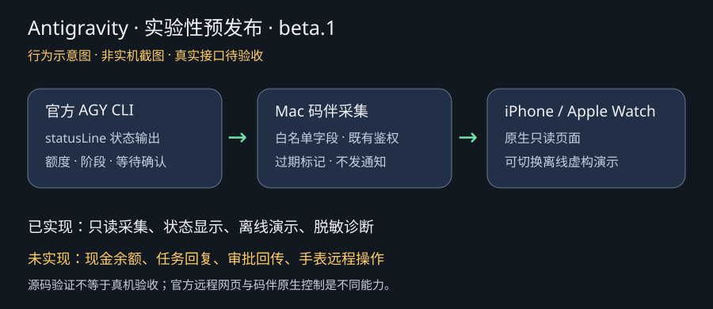
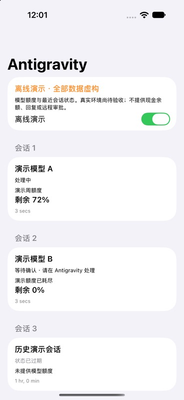
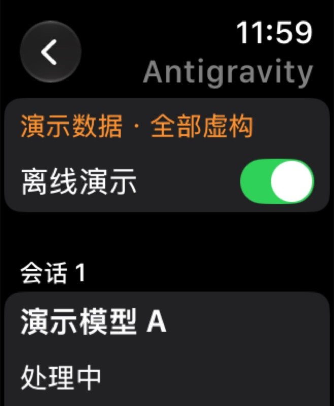

# Antigravity 实验性适配（v3.4.0-beta.1 预发布）

本阶段支持 **AGY CLI 的状态采集 + iPhone / Apple Watch 原生只读页面**。
不要求码伴开发者登录 Google；使用者仍需在自己的电脑上正常登录官方 CLI。
尚未用真实账号完成端到端验收。没有接入 Antigravity 桌面版内部接口。

| 能力 | 当前情况 |
| --- | --- |
| 模型剩余额度、重置时间 | 读取官方 statusLine 最新输出；缺失显示未知，0 显示耗尽 |
| 最近会话阶段、等待确认 | 只读；空闲不代表完成，15 分钟未更新标记过期 |
| 手机与手表离线演示 | 原生页面中开启「离线演示」，全部数据虚构，不写入生产缓存 |
| 现金余额 / AI Credits 数量 | 暂未接入，不能将模型剩余百分比当作余额 |
| 会话回复、批准与拒绝 | 未实现；不生成虚假可操作审批 |
| Bark 提醒 | 暂不发送，避免把状态变化误判为完成 |
| 手机官方网页入口 | 跳转官方远程控制网页，需要独立登录和配置 |
| 手表远程操作 | 尚未实现；网页入口不能替代原生手表能力 |

## 自愿测试者：安装与采集

先安装本仓库 Mac agent（参见 agent/README.md），在它的 Python 虚拟环境里执行：

```sh
python -m codex_watch_agent.antigravity install
```

此命令只配置 `~/.gemini/antigravity-cli/settings.json` 的 `statusLine`，保留其他设置；
首次修改前保存权限为 600 的 `settings.json.codecompanion-backup`。
已有其他自定义 statusLine 时会拒绝覆盖。可在原脚本读取 stdin 后，将同一 JSON 的副本传给
`python -m codex_watch_agent.antigravity ingest`，丢弃该命令 stdout，继续原有渲染。
不要把 stdin 连续读取两次，也不要把整段输入写入日志。

重新启动官方 AGY CLI。在无敏感信息的测试项目中正常使用；码伴仅被动接收 CLI 状态，
不会登录 Google、发起模型调用、开启远程控制或更改权限。
`/usage` 可用于在官方 CLI 主动刷新额度；码伴的刷新按钮仅重新读取本地采样。
安装命令应在长期使用的 agent 虚拟环境运行，不要绑定即将删除的临时测试环境。
采集进程与 agent 必须使用同一个 `CODEX_QUOTA_STATE_DIR`（未配置时采用项目原默认位置）。

更新并重启 agent 和 HTTPS gateway 后，手机／手表从 `Antigravity · 实验性` 入口读取
受既有 `x-watch-token` 保护的 `/antigravity`。新客户端连接旧 agent 会提示服务尚未更新。
旧客户端继续正常工作。现有手机／手表配对、签名及配置无须重置。

卸载采集时，只恢复备份中的 `statusLine` 字段（原先没有则删除该字段），保留之后新增的其他设置。
不要直接用旧备份覆盖整个设置文件。

## 无账号离线开发

先在仓库根目录激活测试环境，并设置一个独立、持久到测试结束的临时状态目录：

```sh
export CODEX_QUOTA_STATE_DIR="$(mktemp -d)"
python -m codex_watch_agent.antigravity ingest < docs/fixtures/antigravity-statusline.json
python -m codex_watch_agent.antigravity diagnose
```

这个 fixture 的会话、模型和额度均为虚构，不应导入生产状态目录。
手机和手表页面的「离线演示」直接使用内存样例，无网络与账号要求；展示处理中、待确认、
额度为零以及过期状态。若演示前发生初次连接失败，打开演示仍能查看全部样例。

## 数据边界与诊断

采集仅保留会话 ID 的散列、模型名、阶段、等待确认标记、模型额度和本地接收时间。
不保留 email、cwd、workspace、transcript_path、凭据、任务原文或未知字段；不读取 CLI 凭据及会话日志。
最多保留 50 个会话的最近状态，不跨会话拼接额度，也不推断账号总余额。
不同会话可能属于不同账号，因此每个会话单独显示，不归并账户。
手机／手表的模型名和额度只传给已有配对客户端。

自愿测试者可执行：

```sh
python -m codex_watch_agent.antigravity diagnose
```

输出仅含接入状态、会话数量、额度条目数量、能力开关，不含会话 ID、模型名、额度值、
邮箱、路径或时间戳。先自行查看，再自愿回传；没有自动上传功能。
**不要发送 settings、数据库、登录凭据或原始 statusLine JSON。**

## 验收清单

1. 未安装采集时，两个客户端显示尚未连接；Codex 与 DeepSeek 正常。
2. 开启离线演示，确认手机与手表文字完整可读，0% 和未知额度不同。
3. 真实 CLI 执行 `/usage`，对照码伴中的每个模型剩余额度与重置时间。
4. 让测试任务进入思考、工作、等待确认；码伴显示阶段，确认操作仍在官方客户端完成。
5. 停止 CLI 超过 15 分钟，页面显示过期，不能继续误报正在运行。
6. 不开启 Bark 提醒、不发送测试通知；诊断回传前确认没有私人信息。
7. 后续回复／审批须单独验证官方支持的双向接口与授权机制，本阶段不宣称完成。

## 依据

- [官方 statusLine 字段与配置](https://antigravity.google/docs/cli/statusline?app=antigravity)
- [官方模型额度查询](https://www.antigravity.google/docs/cli/commands/usage/)
- [官方远程控制](https://www.antigravity.google/docs/remote-control?tab=cli)

实现按 2026-09-30 可读官方文档开发，接口字段仍须真实账号验收。界面示意见下图（非实机截图）：



## 本地验证记录（2026-09-30）

- 192 项 Python 测试通过，包括输入白名单、异常额度、0%、过期、多会话隔离、安装设置保留、鉴权与拒绝写操作。
- 79 项共享 Swift 测试通过，覆盖新协议解码、过期判断、演示数据和 HTTPS 端点限制。
- Xcode 27 的 iOS Simulator 与 watchOS Simulator 目标构建通过，最低部署目标仍为 iOS 17 / watchOS 10。
- iOS 27 模拟器已运行离线演示，截图确认正常额度、0% 和等待确认状态。初次自动控件读取超时，模拟器完成启动后已恢复；手机和手表均验证演示开关及连接失败提示，手机验证刷新，手表验证列表滚动。尚未安装到真机，也未验证 Google 实际输出。

### 无账号调试补充

- 小于 1% 的非零额度显示 `<1%`，接近满额但未满显示 `>99%`；小数秒 ISO 时间可解析。
- 相对状态目录正常读取；异常阶段和超大额度数字不会阻断其他有效数据。
- 并发写入 30 个虚构会话后，通过带鉴权的 HTTP 接口读取并确认隔离；不生成 Codex 通知队列。
- 退出离线演示会重新读取本地服务，避免停留在旧状态。
- `python3 docs/gallery/antigravity.py` 生成隔离工程目录：只替换该目录中的入口为原生演示页，不启动配对、后台刷新或真实服务请求。





手表顶部提示已压缩，各会话合并为一张卡片；图片均为模拟器和虚构数据，不代表真机验证。
