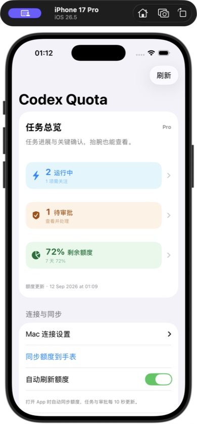
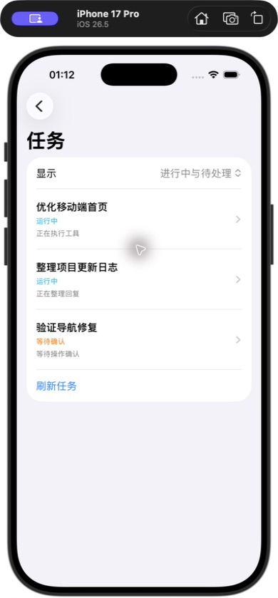
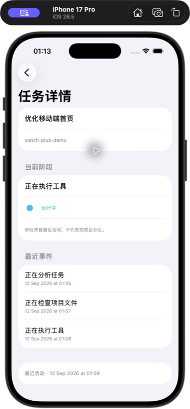
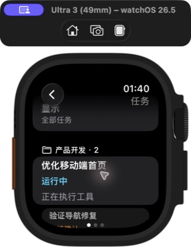
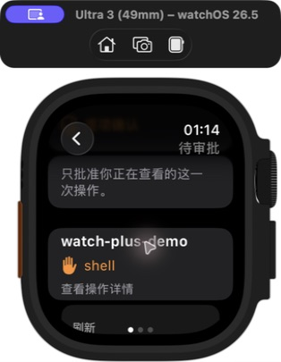
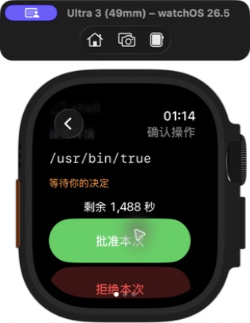
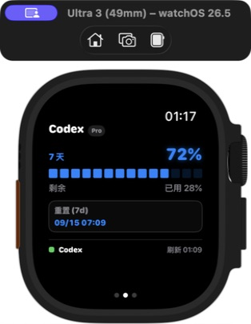

# 界面与功能导览

本页按实际操作介绍 Codex Quota Watch Plus。所有新增截图来自当前 SwiftUI 源码的模拟器展示构建，使用独立的虚构任务与额度数据。展示构建替换数据读取并禁止提交审批，不连接个人 Mac 服务；这些替换不进入正式 App 源码。任务列表截图已更新为项目分组与侧栏名称同步版；其余截图沿用之前版本中布局未变的页面。

## 手机的三个独立入口

| 入口 | 打开后显示 | 可继续操作 |
| --- | --- | --- |
| 运行中 | 按 Codex 项目分组，默认显示全部未归档任务 | 切换全部任务、查看任务详情、刷新 |
| 待审批 | 逐项确认说明及仍可查看的请求 | 打开详情，核对操作与最新状态 |
| 剩余额度 | 官方额度窗口、今日 Tokens、更新时间 | 查看各窗口的剩余额度与重置时间 |

上一版将三个 NavigationLink 放在同一个 Form 行，iPhone 点击时可能统一激活额度链接。现已拆成独立表单行，三个入口分别导航；手表继续使用各自的独立链接。

## 任务列表与进展

默认显示「全部任务」，按 Codex 项目分组；可切换「进行中与待处理」。任务名称优先使用侧栏中手动设置的名称，再使用默认标题；均缺失时显示带短标识的未命名任务。每条任务显示标题、状态和最近阶段；点开后查看项目、当前活动、最近事件与更新时间。任务数量仅统计服务已经跟踪的会话，不是所有 GitHub Issue，也不是项目完成度。

| 列表 | 详情 |
| :---: | :---: |
|  |  |

项目归属优先读取 Codex 原生项目字段，兼容桌面旧版的显式项目分配；没有显式归属时才按工作目录匹配项目。无项目任务归入「未分组」，同名项目仍按不同项目标识区分。这里只读取本机 Codex 数据，不写回侧栏，也不修改任务或项目。

没有活动记录的现有任务显示「尚未监测」，不推断运行或结束状态。已归档任务以及从本机目录中移除的任务不因旧通知记录重新出现。元数据不可读取时，退回已有活动记录与目录名；不会因元数据缺失而自动删除原记录。

蓝色运行状态表示近期有活动。等待回复、等待确认或可能停滞会单独标记；太旧的记录会提示状态待确认。任务标题与事件详情不会被写进额度小组件。

## 手表审批流程

1. 收到镜像提醒，打开 Codex Quota 的「待审批」。
2. 选择请求，检查项目、工具和完整操作；较长内容需要滚动查看。
3. 点击「批准本次」后再次确认，或选择「拒绝本次」。
4. 等待 Mac 回执。显示「批准已交回 Codex」表示决定已经返回，最终执行仍受 Codex 其他规则约束。

| 找到请求 | 查看操作 |
| :---: | :---: |
|  |  |

截图中的 `/usr/bin/true` 是演示操作，不代表自动批准。真实请求会过期；离线、过期或缺少等待进程时无法批准。当前不支持的原生文件变更审批、文字问答等仍需回到 Mac。详见 [远程审批支持范围](remote-approval.md)。

## 额度与小组件

Pro / Plus 标签和额度窗口来自实际数据，不根据套餐名称凭空生成 5 小时窗口。截图只放入一个 7 天演示窗口；你的账户有多少窗口，就按实际结果展示。

iPhone 小号／中号小组件支持独立读取额度，并提供刷新按钮。WidgetKit 决定后台更新时机，因此不能保证每分钟同步。网络失败时保留上次值及更新时间；遇到差异先检查时间，再点刷新。现阶段未提供 Apple Watch 表盘复杂功能。

## 通知、外网和续签

- **静音通知**：Mac 发布状态到 Bark，手机按系统设置展示，Watch 可镜像通知。默认不播放提醒音乐；专注模式和系统通知路由仍会影响呈现。
- **外网连接**：提前配置固定 HTTPS 地址，手机离开家中 Wi-Fi 后仍可访问；Mac 必须开机、联网且服务正常。不是把任务迁移到了云端。
- **自动续签**：定时检查并在满足设备连接、Apple 账号和签名条件时尝试重新构建安装。免费签名仍有有效期，失败需要处理。

部署见 [外网与提醒](enhancements.md)、[自动续签](auto-renew-signing.md)。

## 截图来源

`docs/assets/gallery/` 中的图片由本项目模拟器界面直接截取，包含 Simulator 设备外观。iPhone 17 Pro / Apple Watch Ultra 3 模拟器，系统 26.5；不代表只能使用这两款设备。任务、项目名、请求和额度都是虚构数据，图片仅展示交互与信息布局。README 中的横幅是独立 SVG 功能示意图。
