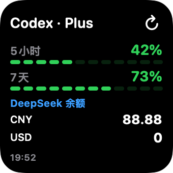
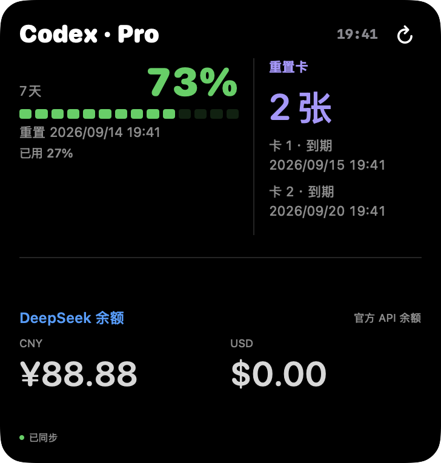
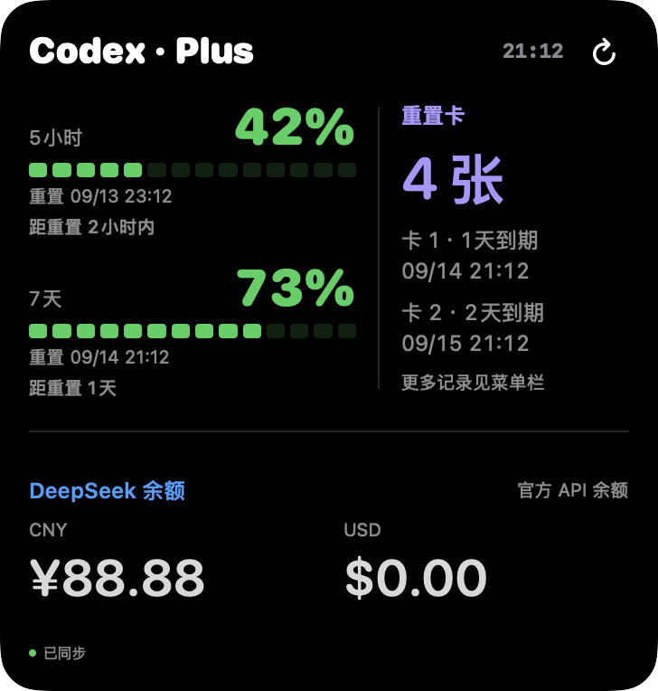
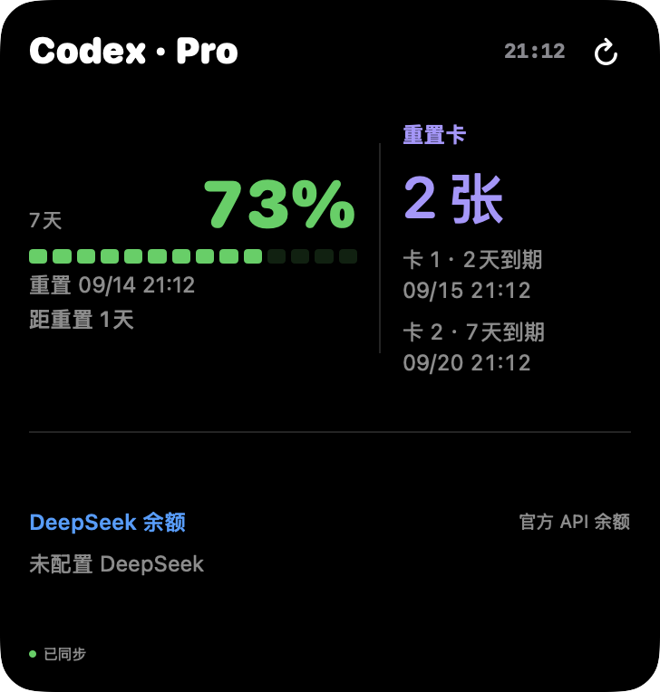

# 码伴小组件分类

本页对应 v3.2.0。Mac 和 iPhone 使用相同分类名称，按用途选择，无需同时添加所有尺寸。

添加列表统一只有「码伴」一个入口，提供三种尺寸：

| 尺寸 | 内容 |
| --- | --- |
| 小号 | 额度进度条；配置 DeepSeek 时增加余额 |
| 中号 | 左侧额度，右侧余额（未配置时为重置卡），底部卡数与用量 |
| 大号 | 额度、重置卡及到期时间、DeepSeek 余额详情 |

合并保留 Mac 的 CodexUsageWidget 和 iPhone 的 CodingQuotaWidget 标识；旧 Mac「额度速览」和旧 iPhone「账户总览」不再注册。由被移除入口添加的组件需重新添加一次，不自动修改桌面配置。Mac 上仍可能同时出现本机与 iPhone 镜像来源，这是系统提供的来源选择。

## 统一外观

各尺寸组件均使用黑底、圆角粗体「Codex · 套餐」标题和右上刷新按钮。Codex 额度统一绿色分段条（≤25% 黄色，≤10% 红色），DeepSeek 蓝色、重置卡紫色；各尺寸只区别信息密度，不再换整套配色。系统桌面着色模式可能改变实际颜色。

## 添加方式

- **Mac**：右键桌面 → 编辑小组件 → 搜索「码伴」→ 选择本机「码伴 Mac」→ 选择尺寸。已有 iPhone 镜像组件也可能同时出现；本机组件直接读取 Mac 摘要，不依赖 iPhone 镜像。
- **iPhone**：打开码伴刷新一次 → 长按桌面 → 编辑 → 添加小组件 → 搜索「码伴」→ 左右切换尺寸。
- 各尺寸组件都可以重复添加。Plus／Pro 按实际窗口显示；无需另装套餐版本。未配置 DeepSeek 时，小号保留 Codex 专用布局，中号右侧显示重置卡。

## 数据与刷新

Mac 速览复用手机的界面实现，但采样保持各端原有口径：Mac 的用量是最近任务累计 token，手机为当日扫描统计，不能直接当成同一指标比较。Mac 没有小时统计时不伪造用量曲线。

账户总览中的重置卡只展示数量与到期时间，不兑换重置券。手机由现有鉴权接口获取白名单字段；接口未提供时显示未知，零张与未提供区分。旧服务／旧快照仍能使用其他功能。

Mac 点击组件或刷新按钮打开本机应用并更新共享摘要；手机速览刷新按钮请求现有 Mac 服务，大号点击打开手机 App。后台重绘由系统调度，不保证立即刷新。

## 展示图

以下为共享 SwiftUI 视图在 Mac 上离屏渲染的虚构数据，不是 iPhone 实机截图。

| 小号（Plus＋DeepSeek） | 中号（Pro＋DeepSeek） |
| --- | --- |
|  |  |

| 中号（未配置 DeepSeek） | 大号账户总览 |
| --- | --- |
|  |  |

源文件：`shared-widgets/ClassicQuotaView.swift`、`macos/Sources/Widget/QuotaWidget.swift`。两端通过各自的数据适配和刷新机制使用共用布局。渲染脚本在 `macos/scripts/render_classic.py` 与 `render_widgets.py`。

单色／着色状态下使用透明度区分进度条，不强制改动系统外观。实现依据 [Apple 小组件着色适配指南](https://developer.apple.com/documentation/widgetkit/optimizing-your-widget-for-accented-rendering-mode-and-liquid-glass)。

## v3.2.0 大号排版

上半区居中、时间文字放大，新增按时间线计算的小时级重置／到期提示。重置卡总数完整显示，明细最多 2 张、最早到期优先；DeepSeek 固定 CNY 在左、USD 在右。以下为本项目原生离屏渲染、虚构数据。

| Pro | Plus 与多张重置卡 | 未配置 DeepSeek |
| --- | --- | --- |
|  |  |  |
